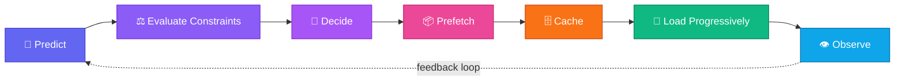

<div align="center">

# ⚡ PulseLoad
### Predictive Adaptive Game Loading

**Predict the likely next game. Decide whether prefetching is worth it. Load progressively. Measure everything.**

[](https://github.com/abhinandan6123/predictive-game-loading/actions/workflows/ci.yml)
[](https://www.python.org/)
[](https://fastapi.tiangolo.com/)
[](LICENSE)

[**🚀 Live App**](https://predictive-game-loading.onrender.com) &nbsp;•&nbsp;
[**📘 API Docs**](https://predictive-game-loading.onrender.com/docs) &nbsp;•&nbsp;
[**💓 Health**](https://predictive-game-loading.onrender.com/health) &nbsp;•&nbsp;
[**📊 Dashboard**](https://predictive-game-loading.onrender.com/dashboard) &nbsp;•&nbsp;
[**📈 Metrics**](https://predictive-game-loading.onrender.com/metrics)

</div>

<br>

## 🧠 Overview

**PulseLoad** is a production-inspired predictive loading system built to cut perceived game-loading latency by preparing likely next-game resources *before* the user asks for them.

Rather than treating every load as a purely reactive event, PulseLoad wraps the whole thing in a decision pipeline — predicting what's next, checking whether it's actually worth prefetching, and loading progressively so the user never stares at a blank screen.

<div align="center">



</div>

<br>

## 🛠️ Technology Stack

<div align="center">

| Layer | Technology |
|---|---|
| **Language** |  |
| **Backend / API** |   |
| **Validation / Data Models** |  |
| **Testing** |  |
| **Code Quality** |  |
| **Containerization** |  Docker Compose |
| **CI/CD** |  |
| **Cloud Deployment** |  |
| **Architecture / Simulation** | Custom Python simulation & policy engine |

</div>

<br>

## 🎯 Skills Demonstrated

<table>
<tr>
<td valign="top" width="33%">

**⚙️ Systems & Architecture**
- Backend API engineering
- System design & architecture
- Cache architecture
- Progressive loading strategies
- REST API design

</td>
<td valign="top" width="33%">

**🧮 Intelligence & Performance**
- Machine learning / predictive systems integration
- Decision & policy systems
- Safety-policy enforcement
- Performance engineering
- Metrics & percentile analysis

</td>
<td valign="top" width="33%">

**🚦 Reliability & Delivery**
- Observability & telemetry
- Failure handling & resilience engineering
- Automated testing
- CI/CD
- Dockerized & cloud deployment
- Git & pull-request workflow

</td>
</tr>
</table>

<br>

## 📐 Key Engineering Decisions

Design choices are documented as **Architecture Decision Records (ADRs)** rather than buried in commit messages — each one captures the *why*, not just the *what*.

| # | Decision | What it covers |
|---|---|---|
| 01 | **Challenge Selection** | Why this problem, and the scope drawn around it |
| 02 | **Adaptive Prefetch Policy** | How the system decides *whether* prefetching is worth the cost |
| 03 | **Cache Architecture** | Storage, eviction, and consistency strategy |
| 04 | **Progressive Loading** | How resources stream in stages instead of all-or-nothing |
| 05 | **Deployment Strategy** | Containerization and cloud rollout approach |

📂 Full write-ups: [`docs/decisions/`](docs/decisions/)

<br>

## 📋 Requirements / Prerequisites

- 🐍 Python 3.12
- 🔧 Git
- 🐳 Docker *(optional)*
- 🌐 Internet connection *(for the live deployment)*

<br>

## ⚠️ Project Limitations

Being upfront about scope, honestly:

- Prototype uses a **simulated** game catalog and workload, not live production traffic.
- Benchmark results come from **deterministic validation scenarios**, not real-world A/B data.
- **Production-scale distributed caching** is future work — current caching is single-node.
- Local Docker validation depended on environment availability at test time.

<br>

## 👥 Team / Authors

<div align="center">

## Authors & Contributions

| Author | Contribution Area |
|---|---|
| **Abhinandan** | System architecture, adaptive prefetch policy, end-to-end integration, performance engineering, ML integration, repository and CI workflow |
| **Shaik Rehana** | Next-game prediction, ranking approaches, contextual modeling, model evaluation and calibration |
| **Sravanthi Deekonda** | Progressive loading, performance measurement, benchmark evaluation and demo support |
| **Rajni** | Cache architecture, prefetch infrastructure, telemetry and observability support |
| **Bhanu** | Quality assurance, responsible-play safety, failure analysis, documentation and submission support |

</div>

<br>


The system combines:

* next-game transition prediction,
* constraint-aware adaptive prefetching,
* policy-driven execution,
* hierarchical caching,
* progressive resource loading,
* network-aware decisioning,
* responsible-play safeguards,
* runtime telemetry,
* metrics,
* a live dashboard,
* automated testing and CI validation,
* Docker-based deployment configuration.

PulseLoad was developed as a research-engineering and hackathon prototype for:

> **FEG Innovation Hackathon 2026 — Challenge 3**
> **Game Load Time — 6–8 Seconds to Near-Instant**

---

# Live Deployment

PulseLoad is deployed as a live FastAPI application.

| Resource             | URL                                                                                                                    |
| -------------------- | ---------------------------------------------------------------------------------------------------------------------- |
| Live Application     | [https://predictive-game-loading.onrender.com](https://predictive-game-loading.onrender.com)                           |
| Health Check         | [https://predictive-game-loading.onrender.com/health](https://predictive-game-loading.onrender.com/health)             |
| Interactive API Docs | [https://predictive-game-loading.onrender.com/docs](https://predictive-game-loading.onrender.com/docs)                 |
| Runtime Dashboard    | [https://predictive-game-loading.onrender.com/dashboard](https://predictive-game-loading.onrender.com/dashboard)       |
| Runtime Metrics      | [https://predictive-game-loading.onrender.com/metrics](https://predictive-game-loading.onrender.com/metrics)           |
| GitHub Repository    | [https://github.com/abhinandan6123/predictive-game-loading](https://github.com/abhinandan6123/predictive-game-loading) |

The deployment is configured through `render.yaml` and uses the repository Docker configuration.

---

# Problem

Traditional game loading is typically reactive:

```text
User selects game
        ↓
Resources begin loading
        ↓
Critical assets arrive
        ↓
Game becomes playable
```

The user waits for loading to begin only after the intent is explicit.

PulseLoad explores a proactive alternative:

```text
User behavior
      ↓
Transition prediction
      ↓
Likely next game candidates
      ↓
Constraint-aware policy
      ↓
FULL / PARTIAL / SKIP
      ↓
Prefetch execution
      ↓
Hierarchical cache
      ↓
Progressive loading
      ↓
Telemetry + metrics
```

The goal is not to prefetch everything.

The goal is to prefetch **only when the expected latency benefit justifies the resource cost and system constraints**.

---

# Core Architecture

The frozen runtime path is:

```text
Client
  │
  ▼
FastAPI
  │
  ▼
Transition Predictor
  │
  ▼
Adaptive Prefetch Policy
  │
  ▼
Prefetch Executor
  │
  ▼
Hierarchical Cache
  │
  ▼
Progressive Loader
  │
  ├──────────────► Telemetry
  │                    │
  ▼                    ▼
Execution Result      Metrics
                         │
                         ▼
                     Dashboard
```

## Design Principle

Each stage has a distinct responsibility:

| Component          | Responsibility                                      |
| ------------------ | --------------------------------------------------- |
| Predictor          | Estimate likely next-game transitions               |
| Policy             | Decide whether prefetching is worthwhile            |
| Executor           | Convert policy decisions into loading actions       |
| Cache              | Prevent redundant resource loading                  |
| Progressive Loader | Prioritize playable resources                       |
| Safety Guard       | Independently block restricted speculative behavior |
| Telemetry          | Record runtime events                               |
| Metrics            | Aggregate runtime behavior                          |
| Dashboard          | Provide runtime observability                       |

This separation keeps the system testable and avoids coupling prediction directly to execution.

---

# Key Features

## 1. Next-Game Prediction

PulseLoad models likely transitions between games and exposes ranked next-game probabilities.

The prediction API allows the system to answer:

> **Given the current game, which games are most likely to be selected next?**

The prediction result becomes an input to the downstream decision policy rather than an automatic execution command.

This distinction is important:

```text
Prediction ≠ Permission to Prefetch
```

A highly probable transition can still be rejected when resource or safety constraints make speculative loading undesirable.

---

## 2. Constraint-Aware Adaptive Prefetching

PulseLoad evaluates multiple factors before selecting an action.

The policy considers signals including:

* prediction probability,
* estimated latency benefit,
* resource cost,
* available bandwidth,
* cache pressure.

The resulting action is one of:

```text
FULL
PARTIAL
SKIP
```

Conceptually:

```text
High expected benefit + acceptable cost
                ↓
              FULL

Moderate benefit or constrained resources
                ↓
             PARTIAL

Low confidence or unfavorable constraints
                ↓
               SKIP
```

The objective is not maximum prefetching.

The objective is **cost-aware prefetching**.

---

# 3. Policy-Driven Prefetch Execution

The execution layer converts policy decisions into deterministic loading operations.

The `/prefetch/execute` endpoint accepts:

* current game,
* target game,
* policy action,
* loading fraction,
* responsible-play permission,
* restricted-session status,
* explicit safety block.

The executor returns:

* action,
* fraction,
* execution status,
* requested bytes,
* loaded bytes,
* cache state.

Example execution flow:

```text
Policy Decision
      │
      ▼
Validate Safety
      │
      ├── Blocked → HTTP 403
      │
      ▼
Validate Resource Parameters
      │
      ├── Invalid → HTTP 400
      │
      ▼
Execute Prefetch
      │
      ▼
Update Cache
      │
      ▼
Emit Telemetry
      │
      ▼
Return Execution Result
```

---

# 4. Hierarchical Cache

PulseLoad uses a hierarchical resource model to distinguish loading priorities.

The cache architecture supports resource tiers such as:

```text
Critical
   ↓
Core
   ↓
Secondary
```

This supports progressive delivery rather than requiring all bytes to be available before meaningful progress can occur.

Repeated requests can produce deterministic cache-hit behavior.

Example:

```text
First request
    ↓
Load permitted resources
    ↓
Cache populated

Second equivalent request
    ↓
Cache hit
    ↓
loaded_bytes = 0
```

Avoiding redundant loading is an important part of reducing unnecessary work.

---

# 5. Progressive Loading

Game resources are modeled as progressive stages.

```text
Stage 1
Critical resources
        ↓
Initial loading progress

Stage 2
Critical + Core
        ↓
Playable state

Stage 3
Critical + Core + Secondary
        ↓
Complete resource availability
```

This allows the system to distinguish:

```text
Time to first bytes
        ≠
Time to playable
        ≠
Time to complete load
```

The architecture therefore supports measuring user-relevant loading stages rather than treating loading as a single binary event.

---

# 6. Responsible-Play Safeguards

Safety decisions are independent from prediction confidence and optimization goals.

The execution API evaluates:

* `responsible_play_allowed`
* `restricted_session`
* `safety_block`

When the responsible-play guard rejects an execution request:

```text
Speculative action is blocked
        ↓
HTTP 403
        ↓
Normal loading remains available
```

The system explicitly preserves the invariant:

> **A safety block must never be converted into a prefetch action.**

This ensures optimization does not override applicable behavioral constraints.

---

# API Surface

The current FastAPI application exposes the following routes.

## Health

### `GET /health`

Verifies service availability.

Live:

[https://predictive-game-loading.onrender.com/health](https://predictive-game-loading.onrender.com/health)

---

## Root

### `GET /`

Provides the application root response.

Live:

[https://predictive-game-loading.onrender.com/](https://predictive-game-loading.onrender.com/)

---

## Prediction

### `POST /predict`

Returns ranked next-game probabilities.

Conceptually:

```text
Current Game
      ↓
Transition Predictor
      ↓
Ranked Candidate Games
      ↓
Probability Distribution
```

---

## Decision

### `POST /decide`

Evaluates policy inputs and returns a prefetch decision.

Possible actions:

```text
FULL
PARTIAL
SKIP
```

---

## Prefetch Recommendation

### `POST /prefetch`

Generates candidate recommendations using prediction and adaptive policy evaluation.

The response includes candidate games and their recommended actions.

---

## Prefetch Execution

### `POST /prefetch/execute`

Executes a policy decision against the resource catalog.

The endpoint supports:

* FULL execution,
* PARTIAL execution,
* SKIP behavior,
* deterministic cache hits,
* invalid resource validation,
* invalid fraction validation,
* responsible-play enforcement.

---

## Integrated Predict + Prefetch

### `POST /predict-prefetch`

Provides an integrated prediction-to-prefetch recommendation flow.

---

## Metrics

### `GET /metrics`

Returns runtime metrics generated by the telemetry pipeline.

Live:

[https://predictive-game-loading.onrender.com/metrics](https://predictive-game-loading.onrender.com/metrics)

---

## Runtime Dashboard

### `GET /dashboard`

Serves the PulseLoad runtime dashboard.

Live:

[https://predictive-game-loading.onrender.com/dashboard](https://predictive-game-loading.onrender.com/dashboard)

---

## Interactive Documentation

FastAPI automatically provides interactive API documentation.

Live:

[https://predictive-game-loading.onrender.com/docs](https://predictive-game-loading.onrender.com/docs)

---

# Quick Start

## Prerequisites

* Python 3.12
* Git
* Docker optional for container validation

---

## Clone

```bash
git clone https://github.com/abhinandan6123/predictive-game-loading.git
cd predictive-game-loading
```

---

## Create a Virtual Environment

### Windows Git Bash

```bash
python -m venv .venv
source .venv/Scripts/activate
```

### macOS / Linux

```bash
python -m venv .venv
source .venv/bin/activate
```

---

## Install Dependencies

```bash
python -m pip install --upgrade pip
pip install -r requirements.txt
```

---

## Run the API

```bash
uvicorn services.api.main:app --reload
```

The local application will be available at:

```text
http://127.0.0.1:8000
```

Useful local URLs:

```text
http://127.0.0.1:8000/health
http://127.0.0.1:8000/docs
http://127.0.0.1:8000/dashboard
http://127.0.0.1:8000/metrics
```

---

# Running Tests

Run the complete test suite:

```bash
pytest -q
```

## Final Local Validation

The final repository validation run completed successfully with:

```text
107 passed, 1 warning
```

The warning is a dependency deprecation warning originating from the FastAPI/Starlette testing stack and did not cause test failures.

---

# Code Quality

PulseLoad uses Ruff for static analysis and formatting.

## Lint

```bash
python -m ruff check .
```

## Check Formatting

```bash
python -m ruff format --check .
```

## Apply Formatting

```bash
python -m ruff format .
```

## Git Whitespace Validation

```bash
git diff --check
```

---

# Continuous Integration

The repository includes a GitHub Actions CI workflow.

The required validation job is:

```text
quality
```

The CI pipeline performs:

```text
Checkout
    ↓
Python 3.12 setup
    ↓
Dependency installation
    ↓
Ruff lint
    ↓
Ruff formatting check
    ↓
Pytest suite
    ↓
Git diff validation
    ↓
Docker build
```

The workflow validates changes submitted through pull requests targeting the protected development branches.

---

# Docker

The project includes:

```text
Dockerfile
docker-compose.yml
render.yaml
```

Build the application locally:

```bash
docker build -t pulseload .
```

Run the container:

```bash
docker run -p 8000:8000 pulseload
```

Verify:

```bash
curl http://localhost:8000/health
```

The Docker image exposes:

```text
8000
```

and includes a health check against:

```text
/health
```

---

# Deployment

PulseLoad is configured for Docker-based deployment.

The repository includes:

```text
render.yaml
```

Deployment configuration includes:

* Docker runtime,
* application service,
* health-check endpoint,
* automatic deployment configuration.

## Live Deployment

**Base URL**

[https://predictive-game-loading.onrender.com](https://predictive-game-loading.onrender.com)

**Health**

[https://predictive-game-loading.onrender.com/health](https://predictive-game-loading.onrender.com/health)

**API Docs**

[https://predictive-game-loading.onrender.com/docs](https://predictive-game-loading.onrender.com/docs)

**Dashboard**

[https://predictive-game-loading.onrender.com/dashboard](https://predictive-game-loading.onrender.com/dashboard)

**Metrics**

[https://predictive-game-loading.onrender.com/metrics](https://predictive-game-loading.onrender.com/metrics)

---

# Performance Evidence

PulseLoad includes deterministic benchmark and validation artifacts.

Tracked evidence includes:

```text
evidence/
├── METRICS_SUMMARY.md
├── metrics_summary.csv
└── results.csv
```

Simulator results include:

```text
simulator/results/
├── baseline_results.csv
└── benchmark_results.csv
```

The repository also contains baseline-versus-PulseLoad comparison work for evaluating the predictive loading approach against a baseline execution path.

---

# Metrics Evidence

The deterministic final validation scenarios produced the following recorded loading-time summary:

| Metric       |   Value |
| ------------ | ------: |
| Mean         | 4080 ms |
| Median       | 2500 ms |
| P50          | 2500 ms |
| P95          | 7840 ms |
| Minimum      | 1200 ms |
| Maximum      | 8000 ms |
| Sample Count |       5 |

These values are preserved as evidence artifacts.

> **Important:** These metrics represent the recorded deterministic validation scenarios in this prototype. They should not be interpreted as universal production latency guarantees.

---

# Runtime Observability

PulseLoad records runtime events across the loading pipeline.

Telemetry includes events associated with:

* prediction requests,
* prefetch requests,
* execution status,
* cache hits and misses,
* resource loading,
* playable-state events.

The runtime metrics surface includes measurements related to:

* request counts,
* prefetch accuracy,
* cache hit rate,
* load count,
* time to playable,
* P50,
* P95.

The dashboard is intentionally observational:

```text
Dashboard unavailable
        ↓
Core API execution remains available
```

Observability must not become a hard dependency for the loading path.

---

# Failure Handling

The project documents expected failure modes and safe fallback behavior.

| Failure Scenario          | Expected Behavior                     |
| ------------------------- | ------------------------------------- |
| Prediction unavailable    | Fall back to normal loading           |
| Low-confidence prediction | Policy may choose SKIP                |
| Cache miss                | Execute permitted prefetch            |
| High cache pressure       | Reduce or skip speculative loading    |
| Invalid game resource     | Return controlled API error           |
| Invalid loading fraction  | Reject without cache mutation         |
| Responsible-play block    | Prevent speculative execution         |
| Restricted session        | Block prefetch                        |
| API failure               | Preserve deterministic error behavior |
| Telemetry unavailable     | Core execution remains deterministic  |
| Dashboard unavailable     | API remains available                 |
| Cold start                | Health endpoint verifies readiness    |

## Core Invariants

1. Safety decisions are independent from prediction confidence.
2. A safety block must never become a prefetch action.
3. Invalid execution parameters must not mutate cache state.
4. Prediction failure must not prevent normal loading.
5. Observability must not become a hard dependency.
6. Dashboard failure must not prevent API operation.

See:

```text
docs/FAILURE_MATRIX.md
```

for the full failure matrix.

---

# Architecture Decisions

The repository documents important engineering decisions using ADR-style records.

Examples include:

```text
docs/decisions/
├── ADR-001-challenge-selection.md
├── ADR-002-adaptive-prefetch-policy.md
├── ADR-003-cache-architecture.md
├── ADR-004-progressive-loading.md
└── ADR-005-deployment-strategy.md
```

These documents capture the rationale behind key architectural choices rather than only describing the final implementation.

---

# Repository Structure

```text
predictive-game-loading/
│
├── services/
│   ├── api/                 # FastAPI application and endpoints
│   ├── cache/               # Cache implementation
│   └── ...
│
├── simulator/
│   ├── games/               # Game resource catalog
│   ├── scenarios/           # Baseline scenarios
│   ├── sessions/            # Synthetic session generation
│   ├── results/             # Benchmark and baseline outputs
│   └── ...
│
├── ml/                      # Prediction and ML-related components
│
├── tests/
│   └── unit/                # Automated unit tests
│
├── demo/
│   └── client.py            # Demo client
│
├── evidence/                # Metrics and validation evidence
│
├── docs/
│   ├── architecture/
│   ├── decisions/
│   ├── experiments/
│   └── submission/
│
├── .github/
│   └── workflows/
│       └── ci.yml           # CI pipeline
│
├── Dockerfile
├── docker-compose.yml
├── render.yaml
├── pyproject.toml
├── requirements.txt
├── CONTRIBUTING.md
├── LICENSE
└── README.md
```

---

# Demo

A structured 60-second demonstration script is available at:

```text
docs/DEMO_SCRIPT.md
```

The demonstration covers:

```text
0–10 sec
Problem

10–20 sec
Next-game prediction

20–30 sec
Adaptive policy decision

30–40 sec
Prefetch execution

40–48 sec
Cache-hit behavior

48–54 sec
Responsible-play block

54–58 sec
Runtime metrics

58–60 sec
Dashboard
```

The repository also includes a demo client:

```text
demo/client.py
```

and associated automated test coverage.

---

# Evidence and Reproducibility

PulseLoad maintains repository-level engineering evidence rather than relying only on screenshots or verbal claims.

Relevant artifacts include:

```text
docs/EVIDENCE_LOG.md
docs/ARCHITECTURE_FREEZE.md
docs/FAILURE_MATRIX.md

evidence/METRICS_SUMMARY.md
evidence/metrics_summary.csv
evidence/results.csv

simulator/results/baseline_results.csv
simulator/results/benchmark_results.csv
```

Final deployment validation evidence is also preserved in the repository history and associated evidence artifacts.

---

# Architecture Freeze

The project defines a frozen runtime path:

```text
Client
→ FastAPI
→ Predictor
→ Adaptive Policy
→ Prefetch Executor
→ Hierarchical Cache
→ Progressive Loader
→ Telemetry
→ Metrics
→ Dashboard
```

After the architecture freeze, major structural changes are intentionally avoided.

Future work should preserve existing interfaces where possible and be evaluated as a separate enhancement rather than silently expanding the submission scope.

This is a deliberate engineering decision:

> **A smaller, validated end-to-end system is preferable to an unbounded architecture with incomplete integration evidence.**

---

# Responsible Performance Claims

PulseLoad is a prototype and research-engineering project.

Performance results should be interpreted in the context of:

* deterministic simulator scenarios,
* configured network conditions,
* synthetic session behavior,
* selected resource catalog,
* benchmark methodology.

The repository intentionally distinguishes between:

```text
Measured evidence
```

and:

```text
Future production expectations
```

The project does not claim that every game, device, or network environment will achieve identical results.

---

# Known Limitations

Current limitations include:

### Simulator-Based Evaluation

The current evaluation environment is deterministic and simulator-driven rather than integrated with a commercial production game engine.

### Synthetic Behavioral Data

Transition behavior is generated from the project simulation environment and should not be interpreted as production player telemetry.

### Local Docker Environment

Docker daemon validation was not available in the final Windows Git Bash environment used for one local validation pass.

The repository still contains:

* Docker configuration,
* Docker build validation in CI,
* deployment configuration.

### Prototype Scope

The project focuses on demonstrating the full predictive-loading decision loop rather than implementing every possible production-scale feature.

---

# Future Work

Potential future directions include:

* production telemetry ingestion,
* online model adaptation,
* contextual and sequence-based predictors,
* real game-engine integration,
* persistent distributed caching,
* adaptive bandwidth estimation,
* more extensive multi-network benchmarking,
* production observability backends,
* A/B experimentation,
* stronger cache eviction strategies,
* personalized transition models,
* cloud-scale deployment experiments.

These are intentionally treated as **future work** rather than being presented as completed functionality.

---

# Contributing

Contributions are welcome.

See:

[CONTRIBUTING.md](CONTRIBUTING.md)

The contribution guide covers:

* development setup,
* local validation,
* testing,
* code quality,
* branch workflow,
* pull request expectations.

---

# License

This project is licensed under the MIT License.

See:

[LICENSE](LICENSE)

---

# Team

Developed by:

* **Venkata Abhinandan Kancharla**
* **Shaik Rehana**
* **Sravanthi Deekonda**
* **Bhanu Venkat**
* **Rajini**

---

# Submission Readiness

Current engineering deliverables include:

* [x] Predictive transition pipeline
* [x] Adaptive prefetch policy
* [x] FULL / PARTIAL / SKIP decisions
* [x] Policy-driven execution
* [x] Hierarchical caching
* [x] Progressive loading
* [x] FastAPI integration
* [x] Responsible-play safeguards
* [x] Runtime telemetry
* [x] Metrics endpoint
* [x] Runtime dashboard
* [x] Automated test suite
* [x] Ruff linting and formatting
* [x] GitHub Actions CI
* [x] Docker configuration
* [x] Cloud deployment configuration
* [x] Live Render deployment
* [x] Benchmark and validation evidence
* [x] Demo client
* [x] Demo recording
* [x] Architecture documentation
* [x] Failure matrix
* [x] Contributing guide
* [x] MIT License

---

## Final System Summary

```text
                 USER BEHAVIOR
                       │
                       ▼
              TRANSITION PREDICTION
                       │
                       ▼
               CANDIDATE RANKING
                       │
                       ▼
              ADAPTIVE POLICY ENGINE
             /          |           \
            ▼           ▼            ▼
          FULL       PARTIAL        SKIP
            │           │
            └─────┬─────┘
                  ▼
           SAFETY VALIDATION
                  │
                  ▼
          PREFETCH EXECUTION
                  │
                  ▼
          HIERARCHICAL CACHE
                  │
                  ▼
          PROGRESSIVE LOADING
                  │
          ┌───────┴────────┐
          ▼                ▼
      TELEMETRY         RESULTS
          │
          ▼
       METRICS
          │
          ▼
      DASHBOARD
```

**PulseLoad demonstrates an end-to-end approach to predictive adaptive game loading: predict likely intent, evaluate whether speculative work is justified, execute safely, load progressively, reuse cached resources, and make the entire pipeline observable.**

````

---
<div align="center">

---

**⭐ If PulseLoad's approach to predictive loading was useful or interesting, consider starring the repo.**

</div>
